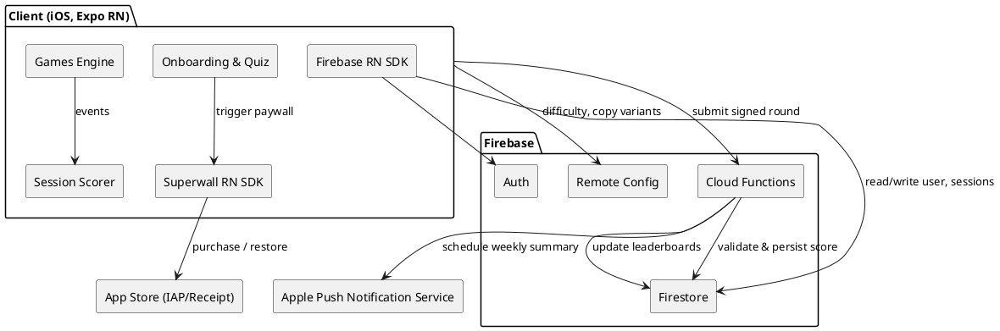
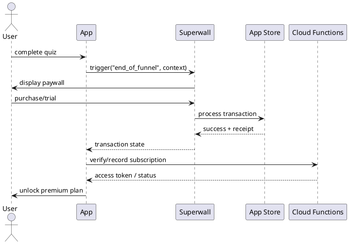

# SPEC-1-Intuition Trainer (PRD)

## Background

**Vision**
Help people measurably strengthen practical intuition (fast, accurate gut decisions) through short, beautiful, science‑informed mini‑games and habit loops.

**Problem**
Most people underuse intuition, leading to decision fatigue, overthinking, and missed opportunities. Current brain‑training apps (Lumosity, Elevate, Peak) focus on memory/attention/math rather than intuition calibration, leaving a gap for training signal‑from‑noise detection and rapid pattern inference.

**Opportunity**
A dedicated "intuition gym" with a strong onboarding funnel can prime users on the importance and trainability of intuition, then convert them to a subscription by demonstrating immediate value and a credible roadmap to improvement.

**Product in one sentence**
An iOS app (built with Expo React Native) that onboards users via a persuasive, research‑framed quiz and then delivers daily intuition mini‑games, progress analytics, and global leaderboards—backed by Firebase (Auth, Firestore, Functions) for identity, data, and real‑time scoring.

**Why this will win**

* Narrow focus on intuition (micro‑prediction, pattern completion under uncertainty, rapid semantic association, anomaly spotting) vs. generic cognition.
* A "soft but strong" onboarding funnel: education + reflection → personalized plan → free trial → subscription page.
* Crisp visuals and satisfying feedback loops; competitive and personal bests; clear skill maps and streaks.

**Key assumptions (to validate)**

* Users will respond to a research‑backed story about intuition's relevance to work, relationships, and creativity.
* Short daily sessions (3–5 minutes) can produce perceived progress within 7 days.
* Leaderboards and percentiles increase retention without feeling gimmicky.
* Firebase is sufficient for v1 scale (up to low 6‑figure MAU) for auth, analytics events, remote config, and near‑real‑time leaderboards.

**Non‑goals for v1 (out of scope)**

* Clinical claims or medical diagnostics.
* Long‑form courses/coaching.
* Wearable integrations.

## Requirements

### Scope & Goals (MoSCoW)

**Must Have**

* iOS app built with **Expo React Native** (SDK 53+), App Store distribution.
* **Onboarding funnel**: multi-step narrative with research snippets, reflection questions, and a short quiz; generates a personalized daily plan.
* **Subscription paywall** powered by **Superwall (Expo SDK)** with remote A/B testing, templates, and campaigns. Free trial and pricing experiments configured in App Store Connect and surfaced via Superwall.
* **Mini‑games** that train intuition facets: pattern completion under uncertainty, signal‑vs‑noise detection, rapid semantic association, anomaly spotting. Each game: tutorial, 60–120s session, end‑of‑round score.
* **Scoring model** per game and **overall Intuition Index** (composite of accuracy, speed, difficulty).
* **Global leaderboards**: overall and per game; daily/weekly/all‑time views.
* **Progress analytics**: streaks, percentile vs. cohort, skill‑area trends.
* **Auth** via Firebase Authentication (Apple, Email/Password; optional Google for future Android).
* **Data** in Firebase Firestore; Cloud Functions for secure score validation and leaderboard aggregation.
* **Design system**: stunning, minimal, high‑contrast visuals; tactile haptics; dark mode; accessibility (VoiceOver labels, Dynamic Type).
* **Privacy & Compliance**: Apple guidelines, age 13+, no medical claims, GDPR/CCPA-ready privacy policy.

**Should Have**

* **Remote Config** to tune difficulty, session length, copy variants without app updates.
* **Events/Analytics**: Firebase Analytics events for funnel steps, game outcomes, retention cohorts.
* **Superwall campaigns** segmented by answers in onboarding quiz (e.g., work vs. creativity persona).
* **Localization-ready** strings framework (start with EN; structure for future locales).

**Could Have**

* **Daily push reminders** (smart send time based on user habit).
* **Social sharing** of milestones (privacy-safe).
* **Guided "intuition drills"** outside games (1–2 minute exercises).

**Won't Have (v1)**

* Android build, wearables, or web client.
* Live multiplayer.
* Clinical validation studies.

### Technical Constraints & Integrations

* **Superwall**: Expo SDK integration for paywalls, campaigns, A/B tests; requires **Expo SDK 53+**.
* **Store setup**: App Store Connect in‑app purchases (monthly, annual, lifetime) with trials; Superwall targets/experiments map to these SKUs.
* **Performance**: cold start < 2.5s on iPhone 12+, 60fps gameplay.
* **Security**: server‑verified scores; anti-tampering checks; minimal PII.

### Success Metrics (Initial Targets)

* **Install → trial start**: ≥ 35%
* **Trial → paid** (7 days): ≥ 8–12%
* **Day‑7 retention**: ≥ 25%
* **Avg. daily session**: 3–5 minutes
* **NPS after 14 days**: ≥ 30

## Method

### Product Flow (High Level)

1. **Install → Onboarding Funnel (3–5 screens)**: science snippets, reflection prompts, short quiz → persona & goals → personalized daily plan.
2. **Paywall (Superwall)**: triggered at end of funnel and contextually (after first perfect round, on day‑3, etc.). Offer free trial → subscription.
3. **Home/Daily Plan**: 3–5 minute session with a curated set of mini‑games.
4. **Session End**: per‑game scores → updated **Intuition Index** → progress insights.
5. **Leaderboards**: global and friends (future) by game and overall; daily/weekly/all‑time.
6. **Retention Loop**: streaks, push reminder at smart time, weekly summary card.

### Architecture (Expo + Firebase + Superwall)



### Data Model (Firestore - proposed collections)

* `users/{uid}`: `{ createdAt, country, persona, onboardingComplete, subscriptionStatus, settings }`
* `profiles/{uid}` (or nested under users): `{ displayName, avatar, streakCount, lastActiveAt }`
* `sessions/{uid}/{sessionId}`: `{ startedAt, endedAt, planVersion, games: [gameRunId...] }`
* `gameRuns/{uid}/{runId}`: `{ gameId, difficulty, accuracy, speedMs, score, seed, clientHash, createdAt }`
* `leaderboards/{scope}` (scope ∈ `daily|weekly|allTime`)/`{gameOrOverall}`/`entries/{uid}`: `{ score, rank, updatedAt }`
* `analyticsDaily/{date}/cohorts/{bucket}`: aggregated KPIs for ops.
* `remoteConfig` (server‑side): difficulty curves, paywall triggers, copy variants.

> Note: We keep user PII minimal; use UID only; optional `displayName`.

### Onboarding Quiz → Persona Segmentation

* **Inputs**: motivation (work, creativity, relationships), pain (overthinking, slow decisions, second‑guessing), time budget, preferred feedback style.
* **Outputs**: `persona` tag (e.g., `work-decider`, `creative-synthesizer`, `calm-chooser`) used to:

  * personalize the **daily plan** (game mix & difficulty),
  * set **copy tone**,
  * choose **Superwall campaign**.

### Games (v1 set: 4)

1. **Pattern Completion**: choose the next card in a visual pattern under time pressure.

   * Signals: micro‑prediction, gestalt closure.
   * Scoring: `score = base * accuracyW * difficultyMult – timePenalty`.
2. **Signal vs Noise**: detect true target among distractors (briefly flashed).

   * Signals: rapid salience detection, uncertainty tolerance.
   * Scoring: combo for consecutive corrects; miss streak resets combo.
3. **Word Association**: pick the most semantically related word quickly.

   * Signals: intuitive semantic mapping.
   * Scoring: partial credit for second‑best; heavier time penalty.
4. **Anomaly Spotter**: spot the outlier in a set.

   * Signals: pattern disruption detection.
   * Scoring: increasing difficulty ladder; early mistakes drop ladder.

**Shared session rules**

* Each round 60–120s; quick tutorial; subtle haptics; immediate micro‑feedback.
* Difficulty adapts between rounds using a **2‑parameter staircase**: if `accuracy ≥ 80%` and `avgResponse ≤ target`, increase difficulty; else decrease slightly.

### Scoring & Intuition Index

* **Per‑game normalized score**: z‑score vs cohort for that difficulty bucket:
  `z = (rawScore – μ_bucket) / σ_bucket`.
* **Intuition Index (0–100)**:
  `index = 50 + 10 * clamp( (Σ w_g * z_g) / Σ w_g , -4, +4 )` where `w_g` weights games equally in v1.
* **Progress**: show 7‑day moving average and percentile change.

### Leaderboards (daily/weekly/all‑time)

* Scope: **Top 100 only** for each board (overall and per game).
* Cloud Function `aggregateLeaderboard(scope, key)` runs every 5 minutes for `daily|weekly`, hourly for `allTime`.
* Writes Top 100 to `leaderboards/{scope}/{key}/entries`.
* Tie‑breakers: higher difficulty, then faster avg response.

### Anti‑Cheat & Validation (MVP)

* Each client round uses a **server‑issued seed** (from Remote Config or Function).
* Client sends minimal **action log hash** + summary stats; server recomputes expected score from seed & difficulty to validate range.
* Reject out‑of‑range or impossible timings; throttle suspicious clients.

### Paywall Logic (Superwall)

* Triggers: `end_of_funnel`, `first_perfect_round`, `day3_return`, `feature_gate_advanced_stats`.
* Experiments: trial length (3 vs 7 days), pricing copy, social proof blocks.
* Restore purchases available in settings; subscription status cached locally and confirmed server‑side via a lightweight function.

### Analytics (Firebase Analytics)

* Funnel: `onb_start`, `onb_quiz_done`, `onb_plan_ready`, `paywall_show`, `trial_start`, `subs_convert`.
* Engagement: `session_start`, `game_run_end`, `streak_day`, `push_open`, `lb_view`.
* Value: `subs_status`, LTV proxy via retention cohorts.

### Key Screens (wireframe list)

* **Funnel**: science card → reflection prompt → 6‑item quiz → plan → paywall.
* **Home**: Today's plan, streak, quick start.
* **Game**: tutorial → round → results card.
* **Insights**: Intuition Index, percentile, trends, game breakdowns.
* **Leaderboards**: tabs for overall & per game; scopes selector.
* **Settings**: account, notifications, restore, privacy.

### Sequence: End‑of‑Funnel → Paywall → Access



## Implementation

### Visual & UX

* **Theme**: *Light minimal with soft gradients*; generous white space, rounded corners (16–24), subtle shadows, iOS haptics.
* **Typography**: SF Pro by default; large headline sizes (34/28), body (17), caption (13) with Dynamic Type.
* **Tone**: *Friendly & motivating* (Headspace‑like warmth) with brief, credible references; avoid academic jargon.
* **Motion**: 150–220ms ease for transitions; micro‑feedback on correct/incorrect.

### Tech Stack (MVP)

* **Client**: Expo React Native (TypeScript), React Navigation, Reanimated, Expo Router, Expo Notifications, AsyncStorage.
* **Monetization**: Superwall (RN/Expo integration) for paywalls, experiments.
* **Backend**: Firebase Auth, Firestore, Cloud Functions (Node), Remote Config, Firebase Analytics.

### Epics & Tasks

1. **Project & CI**

   * Initialize Expo (TS), set iOS bundle id, EAS build profile (development/preview/production).
   * Configure Firebase app, GoogleServices‑Info.plist via Expo config plugins.
   * Set up Superwall SDK, paywall template, and default experiment.
   * GitHub Actions: EAS submit to TestFlight on tag.

2. **Onboarding Funnel**

   * Screens: science card → reflection → 6‑item quiz → plan → paywall (Superwall trigger `end_of_funnel`).
   * Copy system with variant keys for A/B (Remote Config), accessibility labels.
   * Persona mapping function → store `users/{uid}.persona`.

3. **Games Engine**

   * Game shell: tutorial → round (60–120s) → result.
   * Implement 4 games: Pattern Completion, Signal‑vs‑Noise, Word Association, Anomaly Spotter.
   * Difficulty: **simple 2‑step staircase** (increase on ≥80% accuracy & on‑target speed, else decrease slightly). Persist last bucket per game.
   * Session scorer computes raw + normalized score; sends signed payload to Cloud Function.

4. **Data & Security**

   * Firestore collections per **Method** section.
   * Rules: read/write only to own UID; server timestamps; allow read leaderboards; validate field ranges.
   * Cloud Function `submitRun`: verify hash/seed, recompute bounds, write `gameRuns`, update `sessions`.

5. **Leaderboards**

   * Cloud Scheduler → Functions `aggregateLeaderboard(scope,key)` for daily/weekly/all‑time.
   * Top‑N materialized docs; client paginates; tie‑breakers per spec.

6. **Analytics & Remote Config**

   * Events: `onb_start`, `onb_quiz_done`, `onb_plan_ready`, `paywall_show`, `trial_start`, `subs_convert`, `session_start`, `game_run_end`, `streak_day`, `lb_view`.
   * RC keys: `paywall_triggers`, `quiz_copy_variant`, `difficulty_bounds`, `price_copy_variant`.

7. **Paywall & Pricing (Superwall)**

   * IAP SKUs: monthly $6.99, annual $39.99 (7‑day & 3‑day trial variants), lifetime $79.99.
   * Experiments: trial length, social proof block, value bullets order.
   * Triggers: `end_of_funnel`, `first_perfect_round`, `day3_return`, `advanced_stats_gate`.

8. **Insights & Trends**

   * Intuition Index (0–100) with 7‑day moving avg, percentile vs cohort.
   * Game breakdown cards; streak component; weekly summary card.

9. **QA & Compliance**

   * Unit tests on scoring and staircase; device tests on iPhone 12/15.
   * Privacy policy, Terms, App Tracking Transparency (if needed), restore purchases flow.

10. **Launch Ops**

* TestFlight 100 external testers; feedback form link.
* App Store Screenshots (light theme), preview video, keywords.

### Sample Function Sketches (pseudo‑TS)

```ts
// staircase
function nextDifficulty(prev: number, acc: number, avgMs: number, targetMs: number) {
  if (acc >= 0.8 && avgMs <= targetMs) return Math.min(prev + 1, 10);
  return Math.max(prev - 1, 1);
}

// intuition index
function intuitionIndex(zs: number[]) {
  const w = 1 / zs.length; const z = zs.reduce((s,v)=>s+v*w,0);
  return Math.round(50 + 10 * Math.max(-4, Math.min(4, z)));
}
```

### Firestore Rules (snippet)

```js
rules_version = '2';
service cloud.firestore {
  match /databases/{database}/documents {
    match /users/{uid} {
      allow read, write: if request.auth != null && request.auth.uid == uid;
    }
    match /gameRuns/{uid}/{runId} {
      allow create: if request.auth.uid == uid &&
        request.resource.data.score is number && request.resource.data.score <= 100000 &&
        request.resource.data.difficulty >= 1 && request.resource.data.difficulty <= 10;
      allow read: if request.auth != null && request.auth.uid == uid;
    }
    match /leaderboards/{scope}/{key}/entries/{uid} {
      allow read: if true; allow write: if false; // server only
    }
  }
}
```

## Milestones

**M1 – Foundations (Week 1–2)**
Project setup, Firebase + Superwall integration, onboarding scaffold, one playable game prototype.

**M2 – Games & Data (Week 3–4)**
All 4 games, staircase difficulty, scoring + Intuition Index, Cloud Function validation, Firestore rules.

**M3 – Paywall & Analytics (Week 5)**
Paywall triggers, IAP SKUs, Superwall experiments, analytics events, Remote Config.

**M4 – Insights & Leaderboards (Week 6)**
Insights screens, leaderboards aggregation + UI, weekly summary.

**M5 – Polish & Launch (Week 7)**
Accessibility, performance, copy polish, App Store assets, TestFlight → production.

## Gathering Results

* **Dashboards**: retention (D1/D7), trial→paid, ARPPU, session length; cohort charts by persona.
* **A/B Readouts (Superwall)**: trial length, copy variants; roll forward winners after 500 conversions/variant.
* **Quality Signals**: crash‑free users ≥ 99.5%, App Store rating ≥ 4.5 after 50 reviews.
* **Learning Plan**: run 5 user interviews post‑launch to refine onboarding and game clarity; iterate monthly.

